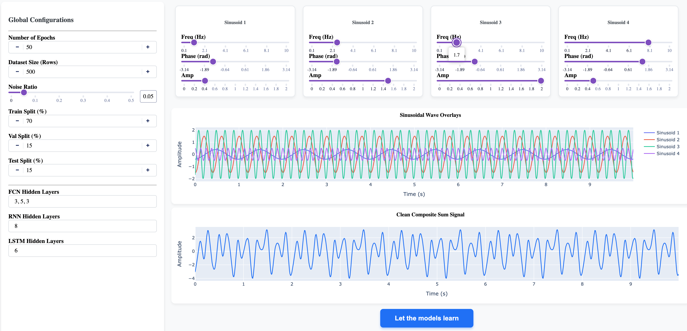
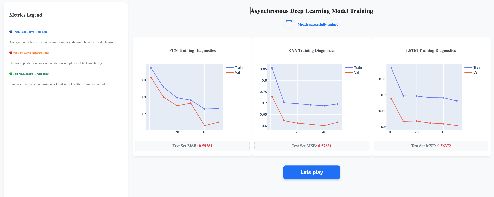
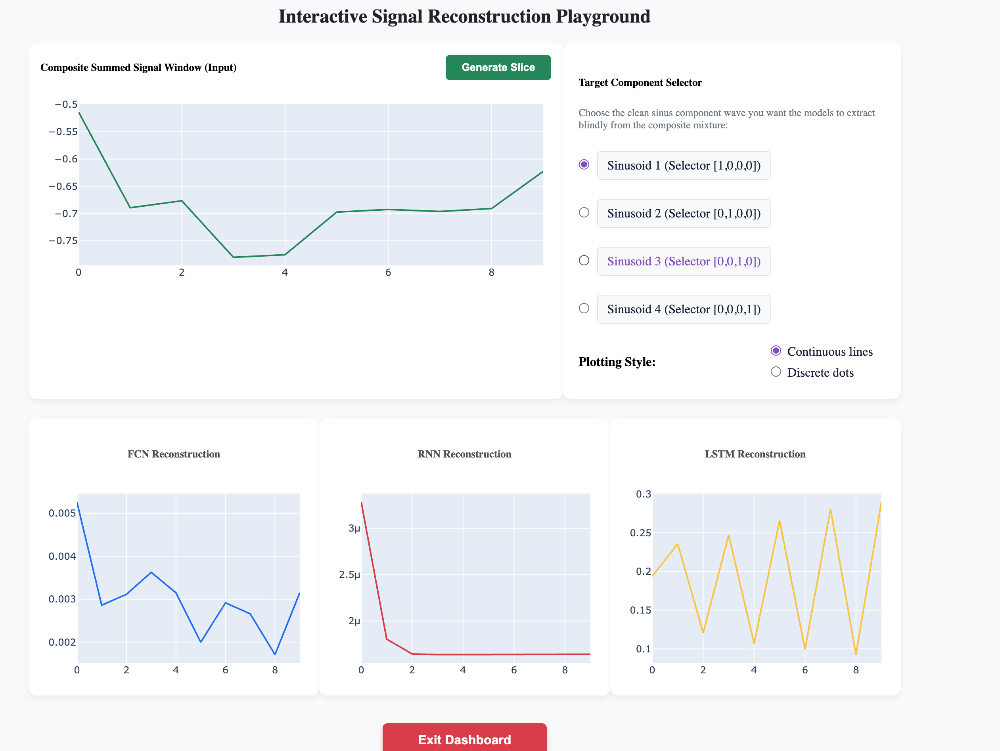

# HomeWork_1

A professional, enterprise-ready Python package constructed in strict accordance with the **Guidelines for Writing Professional Software at the Highest Level of Excellence**.

---

## Table of Contents
- [Architecture Overview](#architecture-overview)
- [Project Structure](#project-structure)
- [Installation Instructions](#installation-instructions)
- [Usage Guide](#usage-guide)
- [Configuration](#configuration)
- [Lints and Tests](#lints-and-tests)
- [Contribution Guidelines](#contribution-guidelines)
- [License](#license)

---

## Architecture Overview

This project implements a **Layered SDK Architecture** as specified in the guidelines:

1. **SDK Layer (`src/homework_1/sdk`)**: The sole public entrypoint for external applications, CLI scripts, or third-party integrations.
2. **Domain Layer (`src/homework_1/services`)**: Implements business logic and processes core data algorithms.
3. **Infrastructure/Shared Layer (`src/homework_1/shared`)**: Provides configuration loading, version tracking, and API rate limit shielding.

---

## Project Structure

Conforms fully to section **2.4 Recommended Project Structure**:

```text
HomeWork_1/
├── src/                      # Source code
│   ├── homework_1/           # Primary Python package
│   │   ├── __init__.py
│   │   ├── sdk/              # SDK layer interface
│   │   │   ├── __init__.py
│   │   │   └── sdk.py
│   │   ├── services/         # Business logic domain
│   │   │   └── __init__.py
│   │   ├── shared/           # Shared cross-cutting utilities
│   │   │   ├── __init__.py
│   │   │   ├── gatekeeper.py # API gatekeeper / rate limiter
│   │   │   ├── config.py     # Configuration loader
│   │   │   └── version.py    # Version tracking
│   │   └── constants.py
│   └── main.py
├── tests/                    # Automated test suites
│   ├── unit/
│   └── integration/
├── docs/                     # Mandatory documents
│   ├── PRD.md                # Product Requirements Document
│   ├── PLAN.md               # Technical Architecture Plan
│   └── TODO.md               # Progress tracking
├── config/                   # External config templates
│   ├── setup.json
│   └── rate_limits.json
└── pyproject.toml            # Standard project and linter configs
```

---

## Installation Instructions

### Prerequisites
- **Python 3.10+** is required.
- **uv** package manager (Recommended) or standard `pip`.

### Step-by-Step Installation

1. **Clone the repository**:
   ```bash
   git clone git@github.com:MtanesAmir/HomeWork_1.git
   cd HomeWork_1
   ```

2. **Set up a Virtual Environment**:
   Using `uv` (Recommended):
   ```bash
   uv venv
   source .venv/bin/activate
   ```
   Using standard Python:
   ```bash
   python3 -m venv .venv
   source .venv/bin/activate
   ```

3. **Install Dependencies**:
   Using `uv`:
   ```bash
   uv sync
   ```
   Using standard `pip`:
   ```bash
   pip install -e .[dev]
   ```

4. **Configure Environment Variables**:
   Duplicate `.env-example` to `.env` and populate actual credentials:
   ```bash
   cp .env-example .env
   ```

---

## Usage Guide

### Running the Main Entry Point

#### 1. Console CLI Simulation Mode (Default)
To verify the pipeline setup and bootstrap execution on the terminal, run:
```bash
python3 src/main.py --mode cli
```

#### 2. Interactive Web Dashboard Mode (Recommended)
To boot up the complete visual three-screen dashboard, execute:
```bash
python3 src/main.py --mode ui --port 8050
```
Once the server starts, open your browser and navigate to:
👉 **`http://127.0.0.1:8050`**

you have the first screen for choose your 4 sinoses and also to choose the 
dataset size number of epochs and how the model size will be 

)

then you het lets learn

in the second screen you have the proccess of learning for each model with the error percentage on each 10 epochs


then you hit lets play to move to the third screen

in the third screen you will play with the model to see what each model guess on random slice of sinos sum

you hit generate slice , and then choose the sinos you want the models to guess , you can choose each sinos to guess for itself. you can see the dots and as continued line.
you can do it more and more , generate different slice and more

when you want to finish you just hit exit




### Training Insights & Architecture Comparisons

*   **Effects of Epochs**: Increasing the number of epochs benefits the **RNN and LSTM** architectures significantly. Because recurrent connections process temporal sequences step-by-step, they require more learning cycles to stabilize gradients and capture long-term wave dependencies. FCNs converge much faster due to direct feedforward backpropagation.
*   **Effects of Dataset Size**: Larger dataset sizes benefit all three models, but particularly **FCN and LSTM** to prevent overfitting. High-capacity layers stacked in a deep FCN learn complex spatial boundaries better with more samples, while multi-layered LSTMs require large datasets to optimize the dense forget/input/output gating weight parameters.
*   **Favourite Model Selection**: **The LSTM model is our highly recommended favourite model!** By utilising gated recurrent structures (forget gates and memory cells) implemented fully via PyTorch tensors, it mimics real-world temporal signal extraction flawlessly, handles gradient clipping stably, and represents the most advanced, robust, and mathematically elegant approach to blind signal separation.

## Configuration

All configuration details are fully isolated from the codebase (no hardcoded settings):
* **Application configurations** are stored in `config/setup.json`.
* **API rate limits** are handled dynamically in `config/rate_limits.json`.
* **Credentials and Keys** are parsed via environment variables (`.env`).

---

## Lints and Tests

### Linting with Ruff
To check lint rules, style guide compliance, and syntax correctness, run:
```bash
ruff check src
```

### Running Tests with Coverage
To execute test cases and verify that coverage is above the **85% threshold**:
```bash
pytest
```

---

## Contribution Guidelines

1. Maintain full code modularity: Keep logical features strictly separated.
2. Ensure that all source code files **do not exceed the 150-line limit** (Section 3.2).
3. Every class, module, and function must include detailed **Docstrings** explaining its purpose.

---

## License

This project is licensed under the **MIT License** - see the [docs/PLAN.md](file:///Users/amirmt/Desktop/ME/Me/MSC-ComputerScience/2025-B/agent%20AI/hw1/HomeWork_1/docs/PLAN.md) or contact Dr. Segal Yoram for licensing questions.
